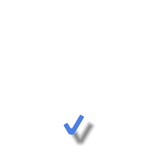

# OhMyGUI
> &#9888;&#65039; This project is a work in progress

Tree based immediate mode GUI library in Jai inspired by Clay and PanGui. For now only OpenGL 4.6 is supported, hence it can only be used on Linux and Windows

## Main features
* Immediate mode API: declare the UI by code each frame, nodes are added/removed/persisted accordingly.
* Tree-based UI: unlike Dear ImGUI, OhMyGUI keeps track of the element tree. This is important to allow easily extending/modifying nodes after they've been declared.
* Layout is done on a separate pass.
* Style aware: all the widgets can be called with an optional style parameter.
* Draw callbacks: drawing is done after layout at the end of the frame. This allows you to attach a different draw callback to any node that has already been declared to customize its visuals to your own needs.
* SDF fonts that look good at any size.
* Primitive based renderer: boxes, glyphs and triangles
* SDF shape renderer: describe shapes using SDF primitives and operations, draw them with a border, background color and outer shadow

## Planned/Todo
* Transitions/animations
* UI element wrapping
* Multiple windows
* Default icon library
* Keyboard navigation
* Clip fade-out
* Custom drawing commands and shaders
* Disabling

Widgets:
* Tables
* Radio buttons
* Progress bar
* Multi line text input
* Trees
* Submenus
* Popups
* Panels
* Tabs

## How it works
Each frame, the user calls `GetNode` with an ID to declare a UI element or get a node that has been declared prior, or any of the widget functions. This builds a tree which is traversed at the end of the frame to lay UI elements out according to properties specified by the user, then draw UI elements that are visible.

UI widgets are simply a function or set of functions that encapsulate declaring the appropriate UI nodes, settings their properties as well as performing UI logic. For example, this the `Button` widget's function:

```jai
Button :: (parent : *Node, width : Size1D, height : Size1D, style : *ButtonStyle = null, location := #caller_location) -> clicked : bool, *Node {
    EnsureStyle(*style, "button"); // Make sure style is not null by retrieving the default style named 'button'

    node := GetNode(parent, location);
    {
        SetSize(node, width, height);
        SetChildAlign(node, 0.5, 0.5);

        button := ButtonBehavior(node);

        state := GetState(node);
        Apply(node, style.states[state].background); // Apply style

        return button.released, node;
    }
}

Button :: (parent : *Node, text : string, style : *ButtonStyle = null, location := #caller_location) -> clicked : bool, *Node {
    EnsureStyle(*style, "button");

    clicked, node := Button(parent, SizeFit(), SizeFit(), style, location);

    text_node := GetNode(node, "text");
    SetText(text_node, text);

    state := GetState(node);

    Apply(text_node, style.states[state].text);

    return clicked, node;
}

ButtonResult :: struct {
    pressed : bool;
    held : bool;
    released : bool;
}

ButtonBehavior :: (node : *Node) -> ButtonResult {
    node.flags |= .Focusable;

    if (IsMouseButtonReleased(.Left) || IsMouseButtonDown(.Left)) && context.omg.mouse_capturing_node == node {
        SetMouseCapture(node);
        SetMouseFocus(node);
    } else if node.state_flags & .Focused && IsMouseButtonPressed(.Left) {
        SetMouseCapture(node);
    }

    if context.omg.mouse_capturing_node == node {
        node.state_flags |= .Hot;
    }

    result : ButtonResult;
    if node.state_flags & .Hot {
        result.held = true;
        result.pressed = IsHovered(node) && IsMouseButtonPressed(.Left);
        result.released = IsHovered(node) && IsMouseButtonReleased(.Left);
    }

    return result;
}
```

Adding a button to your UI is then simply a matter of calling the `Button` function:
```jai
root := OMG.GetNode(window);

if OMG.Button(root, "Hello") {
    print("Hello!\n");
}
```

## Layout
Layout in OhMyGUI is done at the end of the frame based on different properties that the user can set. There are 5 layout modes currently available, which define how children are positioned:
* None
* LeftToRight
* RightToLeft
* TopToBottom
* BottomToTop

The None layout mode means child nodes are not positioned. This is useful for e.g. visual node editors, where nodes position themselves and can be freely moved by the user. The offset property of the node is used in that case as the position of the node relative to its parent.

Note that children cannot decide themselves that they want to be positionned differently.

Sizing can be parameterized in three ways, on both the X and Y axis:
* Pixels (`SizePx(value)` function)
* FitChildren (`SizeFit()` function)
* FillParent (`SizeFill(weight)` function)

Pixels will set the pixel size of the node to the specified value.

Fit children will set the size of the node to the sum of its children, plus the padding and the child gap.

Fill parent will fill the available space in the parent after nodes with fit and fixed sizing have been calculated. A weight value is used to determine the repartition of the space between the children.

## SDF Renderer
OMG can render boxes, glyphs and triangle primitives but it can also render complex SDFs:
```jai
DrawCheckmark :: (draw_list : *OMG.DrawList) {
    size := 40 + 40 * (cos(g_time) * 2 + 2);

    scale := size / 20.0;
    left_height := size * 0.5;
    right_height := size * 0.9;
    angle := PI * 0.17;
    thickness := size * 0.2;
    radiuses := OMG.Vec4f.{1, 1, 2, 2} * scale;

    left := OMG.Box(thickness, left_height, radiuses);
    left = OMG.Transform(left, OMG.Rotate2D(-angle) * OMG.Translate2D(0, -left_height * 0.5));

    right := OMG.Box(thickness, right_height, radiuses);
    right = OMG.Transform(right, OMG.Rotate2D(angle) * OMG.Translate2D(0, -right_height * 0.5));

    shape := OMG.Union(left, right, 0.5 * scale);
    shape = OMG.Move(shape, -0.2 * size * 0.5, -thickness * 0.5);

    OMG.DrawShape(draw_list, .{
        shape=shape,
        position=.{500, 500},
        background_color=OMG.ColorU32(0.3, 0.5, 0.9, 1),
        outer_shadow_color=OMG.ColorU32(0, 0, 0, 0.5),
        outer_shadow_offset=OMG.Vec2f.{15, 15},
        outer_shadow_blur=5,
    });
}
```
This draws a blue checkmark with an outer shadow:


